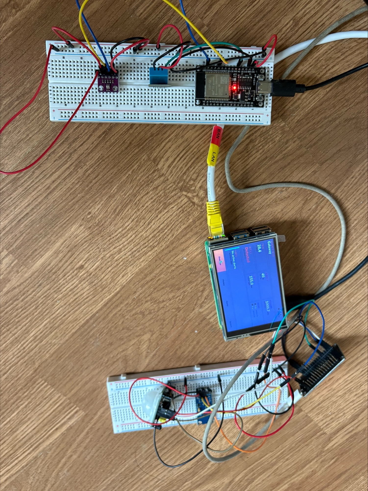
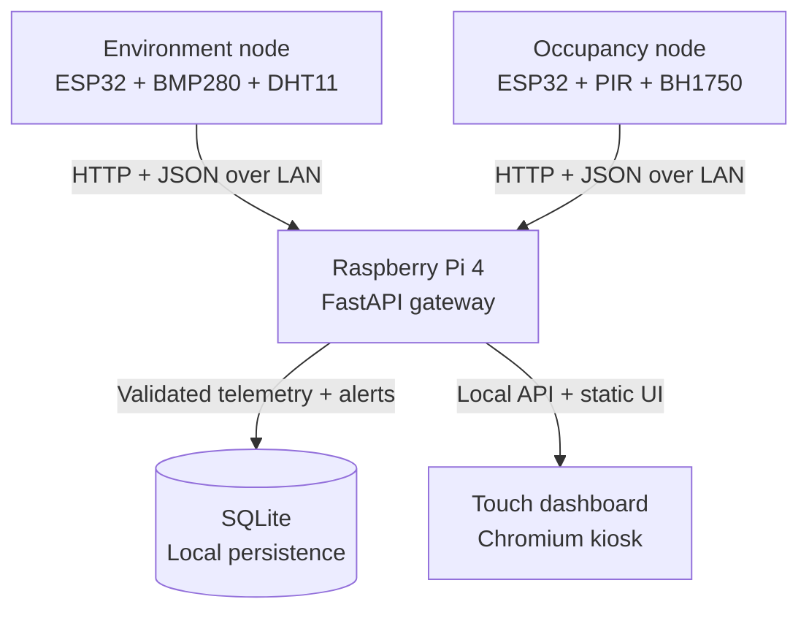

# Sovereign Edge Gateway

**Distributed sensing. Local processing. No cloud dependency.**

Sovereign Edge Gateway is a working local-first edge-computing prototype built
with a Raspberry Pi 4 and two distributed ESP32 sensor nodes. It collects
environmental, ambient-light and motion telemetry over a local Wi-Fi network,
validates and stores the data in SQLite, evaluates local alert rules, and
presents live system state through an attached touchscreen dashboard.

The complete operational data path runs on locally owned hardware. Internet
access, cloud storage and third-party dashboards are not required.

> This is an engineering prototype, not a production-certified monitoring or
> safety system.

## Prototype Media



The image and demo video show the Raspberry Pi gateway, touchscreen dashboard,
ESP32 sensor nodes and breadboarded sensor components operating together as a
functional local-first prototype.

[Watch the working prototype demo video](docs/media/sovereign-edge-gateway-demo.mov)

## Why This Project Exists

Sovereign Edge Gateway was conceived in response to the European Commission’s June 2026 [European Technological Sovereignty Package](https://digital-strategy.ec.europa.eu/en/news/commission-proposes-tech-sovereignty-package-strengthen-europes-digital-autonomy-and-resilience), particularly its [EU Open Source Strategy](https://digital-strategy.ec.europa.eu/en/factpages/eu-open-source-strategy).

The strategy positions open-source technology as a way to strengthen user control, reduce dependence on proprietary providers and avoid vendor lock-in. This project explores what those principles could look like at the scale of a connected edge appliance:

> Can a useful distributed sensor system operate entirely on owner-controlled hardware, using an open-source software stack and no mandatory third-party cloud services?

The resulting prototype keeps sensing, transport, processing, storage, alerting and visualisation within the local network. It uses ESP32 sensor nodes, a Raspberry Pi gateway, FastAPI, SQLite and a locally served dashboard without requiring external cloud infrastructure.

This is an independent engineering prototype inspired by the package’s objectives, not an EU-sponsored project or a claim of regulatory compliance.

## Architecture



| Layer | Active implementation |
|---|---|
| Sensor nodes | Two ESP32 microcontrollers |
| Transport | HTTP POST with JSON over local Wi-Fi |
| Gateway | Raspberry Pi 4 |
| Backend | Python and FastAPI |
| Persistence | SQLite |
| Interface | Static HTML, CSS and JavaScript |
| Display | 3.5-inch 480x320 SPI touchscreen |
| Deployment | `systemd`, X11 and Chromium kiosk mode |
| Alerting | Local rule engine with persisted alert lifecycle |
| Cloud dependency | None |
| MQTT | Considered and deliberately deferred |

## Current Capabilities

| Capability | Implementation | Status |
|---|---|---|
| Temperature sensing | BMP280 on environment node | Working |
| Atmospheric pressure sensing | BMP280 on environment node | Working |
| Humidity sensing | DHT11 on environment node | Working |
| Motion detection | PIR on occupancy node | Working |
| Ambient-light sensing | BH1750 on occupancy node | Working |
| Distributed sensor topology | Two independent ESP32 nodes | Working |
| Local telemetry | HTTP/JSON over Wi-Fi | Working |
| API ingestion and queries | FastAPI | Working |
| Local persistence | SQLite telemetry and alerts tables | Working |
| Motion and light display | Live state, history and dashboard integration | Working |
| Backend autostart | Linux `systemd` service | Working |
| Physical interface | Waveshare 3.5-inch LCD and resistive touch | Working |
| Appliance boot flow | X11 and Chromium kiosk autostart | Working |
| Combined touch dashboard | Overview, History, Alerts and System views | Working |
| Persisted local alerts | Rule evaluation, resolution and acknowledgement | Working |
| Per-node system status | Telemetry-recency health summary | Working |
| Display sleep | 10-minute X11 blanking/DPMS with touch wake | Working |
| MQTT transport | Alternative telemetry transport | Deferred |

## System Operation

1. The environment ESP32 reads temperature and pressure from a BMP280 and
   humidity from a DHT11.
2. The occupancy ESP32 reads motion state from a PIR sensor and ambient light
   from a BH1750.
3. Each node sends JSON telemetry to the gateway over the local network.
4. FastAPI validates each request and writes it to the relevant SQLite table.
5. Alert rules evaluate fresh telemetry and node recency.
6. The dashboard polls local query endpoints and renders current readings,
   recent history, alert state and system status.
7. `systemd` starts the API after boot; Chromium opens the dashboard in kiosk
   mode on the attached display.
8. X11 blanks the display after 10 minutes of inactivity and wakes on touch
   input where the display driver supports it.

No data has to leave the LAN during normal operation.

## Hardware

### Gateway

- Raspberry Pi 4, 8 GB
- Raspberry Pi OS
- Waveshare 3.5-inch RPi LCD (C)
- 480x320 ILI9486 SPI framebuffer
- ADS7846/XPT2046 resistive touchscreen

### Environment Node

- ESP32 development board
- BMP280 temperature and pressure sensor
- DHT11 humidity sensor module

### Occupancy and Light Node

- ESP32 development board
- PIR motion sensor
- BH1750 ambient-light sensor

## Wiring

### Environment Node

| BMP280 | ESP32 |
|---|---|
| VCC/VIN | 3V3 |
| GND | GND |
| SDA/SDI | GPIO 21 |
| SCL/SCK | GPIO 22 |
| CSB | 3V3 |
| SDO | GND |

The tested BMP280 reports chip ID `0x58` at I2C address `0x76`.

| DHT11 module | ESP32 |
|---|---|
| Data | GPIO 4 |
| VCC | 3V3 |
| GND | GND |

The tested DHT11 is a three-pin module with an onboard pull-up resistor. Verify
the pin labels or module-specific pinout before powering a different board;
DHT11 module layouts are not universal.

### Occupancy and Light Node

| PIR | ESP32 |
|---|---|
| VCC | 5V/VIN |
| GND | GND |
| OUT | GPIO 23 |

The PIR is configured in repeat-trigger mode with its delay near minimum.

| BH1750 | ESP32 |
|---|---|
| VCC | 3V3 |
| GND | GND |
| SDA | GPIO 21 |
| SCL | GPIO 22 |
| ADDR | GND or unconnected |

The BH1750 is detected at I2C address `0x23`.

## Software Stack

- **Firmware:** Arduino-compatible C++ on ESP32
- **Sensor protocols:** I2C and GPIO
- **Telemetry:** HTTP and JSON
- **Gateway API:** Python, FastAPI and Uvicorn
- **Database:** SQLite
- **Frontend:** semantic HTML, CSS Grid/Flexbox and vanilla JavaScript
- **Process management:** `systemd`
- **Display session:** X11 on the LCD framebuffer
- **Operator interface:** Chromium kiosk mode

The frontend intentionally avoids frameworks, remote fonts, CDNs and GPU-heavy
effects. This keeps the appliance responsive and usable without an internet
connection.

## API

The API listens on port `8001`.

| Method | Endpoint | Purpose |
|---|---|---|
| `GET` | `/` | API root |
| `GET` | `/health` | Gateway health check |
| `GET` | `/dashboard` | Local dashboard |
| `GET` | `/system/status` | API, database and node-health summary |
| `GET` | `/alerts` | Active or historical alert list |
| `GET` | `/alerts/history` | Alert history |
| `POST` | `/alerts/{alert_id}/acknowledge` | Acknowledge an alert |
| `POST` | `/sensor` | Ingest environment telemetry |
| `GET` | `/latest` | Latest environment reading |
| `GET` | `/history` | Environment history |
| `POST` | `/motion` | Ingest motion state |
| `GET` | `/motion/latest` | Latest motion state |
| `GET` | `/motion/history` | Motion-event history |
| `POST` | `/light` | Ingest ambient-light telemetry |
| `GET` | `/light/latest` | Latest light reading |
| `GET` | `/light/history` | Light history |

### Environment Telemetry

```json
{
  "device": "environment_node_01",
  "temperature": 23.3,
  "pressure": 1020.56,
  "humidity": 48.0
}
```

### Motion Telemetry

```json
{
  "device": "sensor_node_02",
  "motion": true
}
```

### Light Telemetry

```json
{
  "device": "sensor_node_02",
  "lux": 125.5
}
```

### Alert Triggers

The current local alert rules are:

- `node1_stale`: environment node telemetry is older than 30 seconds.
- `node2_stale`: occupancy/light node telemetry is older than 30 seconds.
- `high_temperature`: temperature above 30.0 C.
- `low_temperature`: temperature below 10.0 C.
- `high_humidity`: humidity above 75.0%.
- `low_light`: light below 20 lux.
- `motion_in_darkness`: motion detected within 30 seconds of low light.

Alerts are persisted in SQLite. Active alerts resolve when their condition
clears, while acknowledgement is tracked separately.

### Health Check

```bash
curl http://localhost:8001/health
```

### Test Ingestion Locally

```bash
curl -X POST http://localhost:8001/sensor \
  -H "Content-Type: application/json" \
  -d '{
    "device": "test_environment_node",
    "temperature": 23.3,
    "pressure": 1020.56,
    "humidity": 48.0
  }'
```

Use the gateway's LAN address instead of `localhost` when testing from another
device.

## Local Data Model

Telemetry is separated by measurement type rather than stored in one sparse
table. Alert lifecycle state is stored separately.

```sql
CREATE TABLE sensor_readings (
    id INTEGER PRIMARY KEY AUTOINCREMENT,
    device TEXT NOT NULL,
    temperature REAL NOT NULL,
    pressure REAL NOT NULL,
    humidity REAL,
    received_at TEXT NOT NULL
);

CREATE TABLE motion_events (
    id INTEGER PRIMARY KEY AUTOINCREMENT,
    device TEXT NOT NULL,
    motion INTEGER NOT NULL,
    received_at TEXT NOT NULL
);

CREATE TABLE light_readings (
    id INTEGER PRIMARY KEY AUTOINCREMENT,
    device TEXT NOT NULL,
    lux REAL NOT NULL,
    received_at TEXT NOT NULL
);

CREATE TABLE alerts (
    id INTEGER PRIMARY KEY AUTOINCREMENT,
    alert_key TEXT NOT NULL,
    severity TEXT NOT NULL,
    title TEXT NOT NULL,
    message TEXT NOT NULL,
    source TEXT NOT NULL,
    active INTEGER NOT NULL,
    acknowledged INTEGER NOT NULL,
    created_at TEXT NOT NULL,
    updated_at TEXT NOT NULL,
    resolved_at TEXT,
    acknowledged_at TEXT
);
```

SQLite provides durable local storage without requiring a separate database
server.

## Repository Structure

```text
sovereignEdge/
|-- README.md
|-- .gitignore
|-- docs/
|   `-- media/
|       |-- sovereign-edge-gateway-demo.mov
|       `-- sovereign-edge-gateway-prototype.jpeg
|-- ESP-Sketches/
|   |-- node1_final/
|   |   |-- node1_final.ino
|   |   `-- secrets.h.example
|   |-- node2/
|   |   |-- node2.ino
|   |   `-- secrets.h.example
|   |-- node1___bmp280_and_wifi/
|   |   |-- node1___bmp280_and_wifi.ino
|   |   `-- secrets.h.example
|   `-- wifi_test/
|       |-- wifi_test.ino
|       `-- secrets.h.example
`-- pi-live/
    |-- app.py
    |-- dashboard.html
    |-- dashboard.css
    |-- dashboard.js
    |-- requirements.txt
    |-- autostart/
    |   |-- sovereign-dashboard.desktop
    |   `-- sovereign-display-sleep.desktop
    `-- systemd/
        `-- sovereign-gateway.service
```

Generated databases, Python virtual environments, credentials, private network
details, browser profiles, runtime logs and backup files should not be
committed.

## Installation

### 1. Clone the Repository

```bash
git clone https://github.com/Codeedup/sovereign-edge-gateway.git
cd sovereign-edge-gateway
```

### 2. Create the Python Environment on the Pi

```bash
cd pi-live
python3 -m venv venv
source venv/bin/activate
python -m pip install --upgrade pip
pip install -r requirements.txt
```

### 3. Start the Gateway Manually

```bash
uvicorn app:app --host 0.0.0.0 --port 8001
```

Open:

```text
http://localhost:8001/dashboard
```

Confirm that the service responds before configuring autostart:

```bash
curl http://localhost:8001/health
curl http://localhost:8001/system/status
```

### 4. Configure the ESP32 Nodes

For each node:

1. Copy `secrets.h.example` to `secrets.h`.
2. Add the local Wi-Fi credentials.
3. Set `GATEWAY_BASE_URL` to the Raspberry Pi gateway address.
4. Install the sensor libraries required by that sketch.
5. Compile and upload the firmware.
6. Confirm successful sensor readings in the serial monitor.
7. Confirm HTTP `200` responses from the gateway.

Keep `secrets.h` out of version control. Do not publish real SSIDs, passwords
or machine-specific IP addresses.

### 5. Install the Backend as a Service

Review the paths and user in `pi-live/systemd/sovereign-gateway.service`, then
install it:

```bash
sudo cp pi-live/systemd/sovereign-gateway.service \
  /etc/systemd/system/sovereign-gateway.service
sudo systemctl daemon-reload
sudo systemctl enable --now sovereign-gateway
sudo systemctl status sovereign-gateway --no-pager
```

Useful service commands:

```bash
sudo systemctl restart sovereign-gateway
journalctl -u sovereign-gateway -f
```

Do not start a second manual Uvicorn process while the service owns port
`8001`.

### 6. Configure Kiosk Mode and Display Sleep

Review the browser path and dashboard URL in
`pi-live/autostart/sovereign-dashboard.desktop`, then install it for the
desktop user:

```bash
mkdir -p ~/.config/autostart
cp pi-live/autostart/sovereign-dashboard.desktop ~/.config/autostart/
cp pi-live/autostart/sovereign-display-sleep.desktop ~/.config/autostart/
```

The tested boot flow is:

```text
Raspberry Pi boots
-> console auto-login
-> X11 starts on the LCD framebuffer
-> FastAPI starts through systemd
-> Chromium opens in kiosk mode with a fresh temporary profile
-> local dashboard loads
-> display blanks after 10 minutes of inactivity
-> touchscreen input wakes the dashboard
```

The Waveshare display uses `/dev/fb1` in the tested configuration. Display
overlays, framebuffer selection and true backlight control are hardware- and
operating-system-specific. The current display sleep method uses X11 blanking
and DPMS because no software backlight control is exposed under
`/sys/class/backlight` on the tested device.

## Dashboard Design

The operator interface is a combined touch dashboard with Overview, History,
Alerts and System views. It is designed for the 480x320 LCD first, while still
being readable from a laptop browser on the same network.

The dashboard shows:

- temperature, humidity and pressure;
- current motion and light state;
- node health for both ESP32 devices;
- active alert count and alert details;
- recent environment, motion and light history;
- gateway and database status.

The kiosk uses a fresh temporary Chromium profile and a cache-busted dashboard
URL to avoid stale browser-session recovery after an unsafe power-off.

## Engineering Decisions

### HTTP Before MQTT

HTTP made the first end-to-end telemetry path simple to inspect with a serial
monitor, `curl`, browser tools and FastAPI logs. MQTT remains a valid future
transport, but the current system does not require a broker.

### SQLite Before a Database Server

The appliance has one gateway writer and a modest telemetry workload. SQLite
provides durable storage with minimal memory use and almost no operational
overhead.

### Two ESP32 Nodes

Separating environmental sensing from motion and light demonstrates a real
distributed topology and independent node health, rather than using the
microcontrollers as unnecessary wiring adapters.

### Vanilla Frontend

Static HTML, CSS and JavaScript keep the dashboard understandable, fast to load
and independent of package registries or CDNs at runtime.

### Appliance-Style Deployment

`systemd`, X11 display sleep, and kiosk autostart allow the gateway to recover
after a reboot and return to its operator interface without manual terminal
commands.

### Local-First as a Constraint

Local operation is the architecture, not a fallback mode. Cloud services,
Telegram alerts and speaker features are deliberately outside this project's
scope.

## Challenges Solved

- Identified an incorrectly assumed BME280 as a BMP280 using its chip ID.
- Resolved ESP32 Wi-Fi reconnection and saved-configuration issues.
- Combined I2C and GPIO sensors across two independently reporting nodes.
- Debugged request formatting separately from server availability.
- Extended the API and SQLite schema without breaking existing environment
  telemetry.
- Configured a non-standard SPI framebuffer for the Raspberry Pi desktop.
- Verified raw ADS7846 touchscreen input and restored desktop touch operation.
- Removed Chromium's startup keyring interruption for unattended kiosk use.
- Converted the backend from a manually started process into a persistent
  Linux service.
- Replaced the split dashboard with one combined UI for LCD and laptop use.
- Added persisted local alerts, node stale detection and alert acknowledgement.
- Fixed stale Chromium kiosk recovery by launching with a fresh temporary
  profile and cache-busted dashboard URL.
- Added 10-minute X11 display sleep with touch wake.

## Verification

The current prototype has demonstrated:

- sensible BMP280, DHT11 and BH1750 readings;
- PIR motion and clear-state transitions;
- successful HTTP `200` responses from both ESP32 nodes;
- persistent environment, motion, light and alert records in SQLite;
- API access from another machine on the LAN;
- a working combined dashboard on the attached LCD and laptop;
- resistive touchscreen input;
- backend, kiosk and display-sleep recovery after boot;
- zero active alerts in the latest live smoke test.

For a fresh installation, verify each layer in order:

```text
Sensor reading
-> ESP32 network connection
-> HTTP 200 response
-> SQLite row
-> latest/history endpoint
-> alert evaluation
-> dashboard update
-> reboot recovery
-> 10-minute display blanking and tap wake
```

## Security and Privacy Notes

The prototype reduces external data exposure by keeping telemetry on the local
network, but local-only does not automatically mean secure.

Current limitations include:

- HTTP traffic is not encrypted.
- Sensor nodes are not authenticated.
- API authorization is not implemented.
- Physical access to the Raspberry Pi can expose the database.
- Local network security remains an external dependency.

Before using this architecture outside a controlled prototype environment, add
device authentication, request integrity protection, network segmentation,
least-privilege service configuration, secure secret provisioning and an
explicit data-retention policy.

## Current Limitations

- The project is a prototype, not an industrial control or certified safety
  device.
- Node availability is inferred from telemetry recency rather than a dedicated
  heartbeat protocol.
- HTTP delivery has no store-and-forward queue when the gateway is unavailable.
- DHT11 accuracy and resolution are limited compared with higher-grade sensors.
- Hardware remains in a breadboard-stage build rather than a finished enclosure.
- Automated tests and continuous integration are not yet established.
- True LCD backlight shutoff depends on hardware support not exposed by the
  tested SPI display driver.

## Roadmap

- [x] Read BMP280 temperature and pressure
- [x] Add DHT11 humidity
- [x] Send environment telemetry from ESP32 node 1
- [x] Persist environment readings in SQLite
- [x] Add PIR motion sensing to ESP32 node 2
- [x] Add BH1750 ambient-light sensing
- [x] Persist and display motion and light data
- [x] Run FastAPI through `systemd`
- [x] Boot directly into the local Chromium dashboard
- [x] Complete the combined 480x320 touch dashboard
- [x] Add local rules and persisted alerts
- [x] Add per-node stale/offline state and system-health summary
- [x] Add display sleep and tap wake
- [ ] Add automated backend and API tests
- [ ] Add request authentication and integrity protection
- [ ] Design a permanent enclosure and power-distribution solution
- [ ] Evaluate MQTT only if delivery semantics or node scale justify it

## Project Scope

This repository intentionally focuses on a sovereign edge gateway:

- local sensor collection;
- local processing;
- local persistence;
- local visualization;
- local operational alerts.

Voice-assistant features, speakers, Telegram integration and cloud services
belong to separate projects and are intentionally excluded.

## Author

Built by **Dylan Moffett** as a hands-on exploration of embedded systems,
edge-computing architecture and local-first infrastructure.
